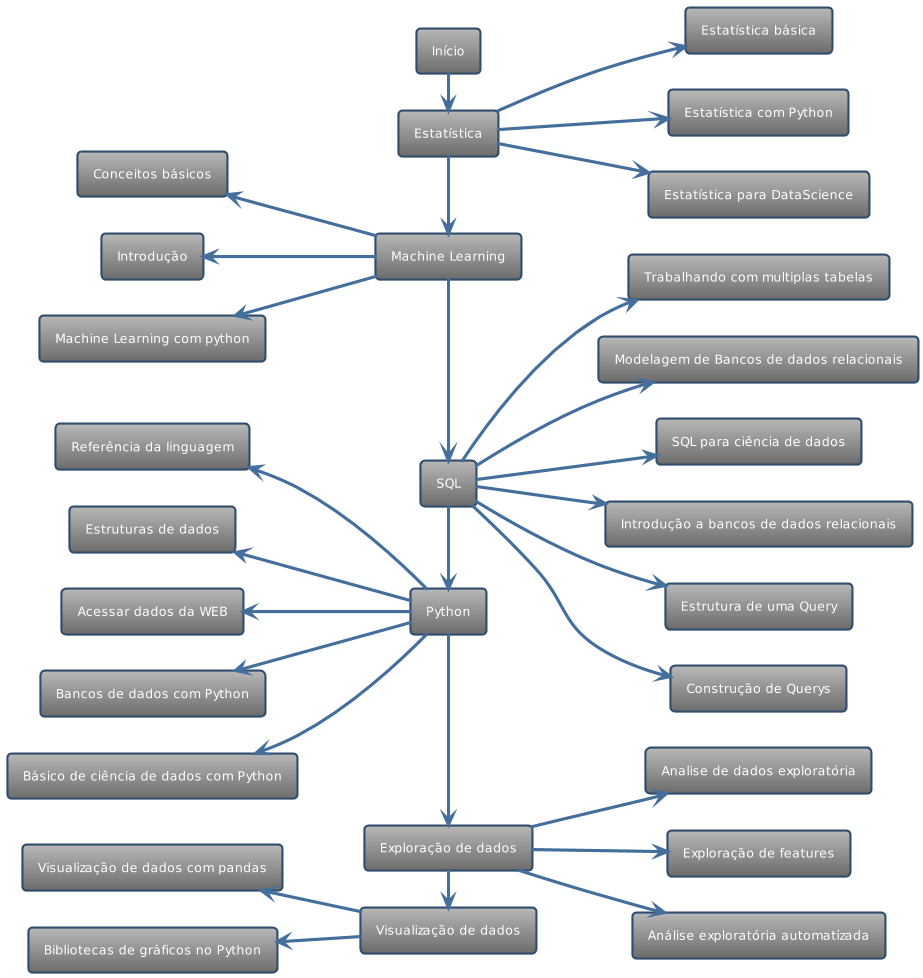
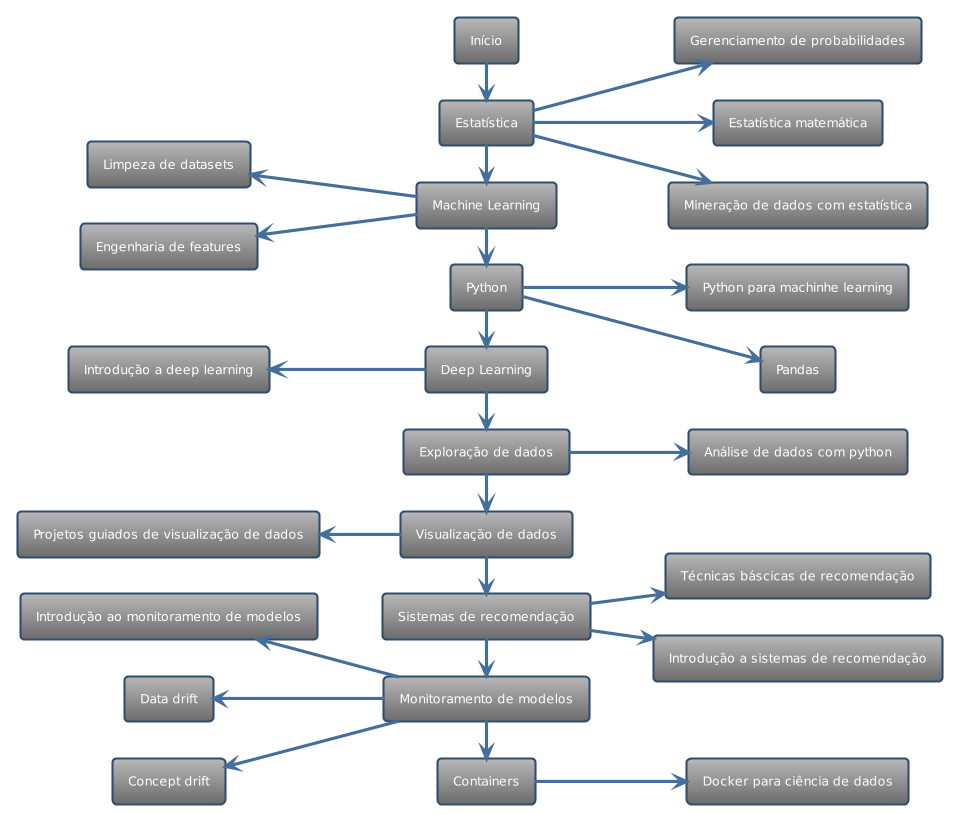
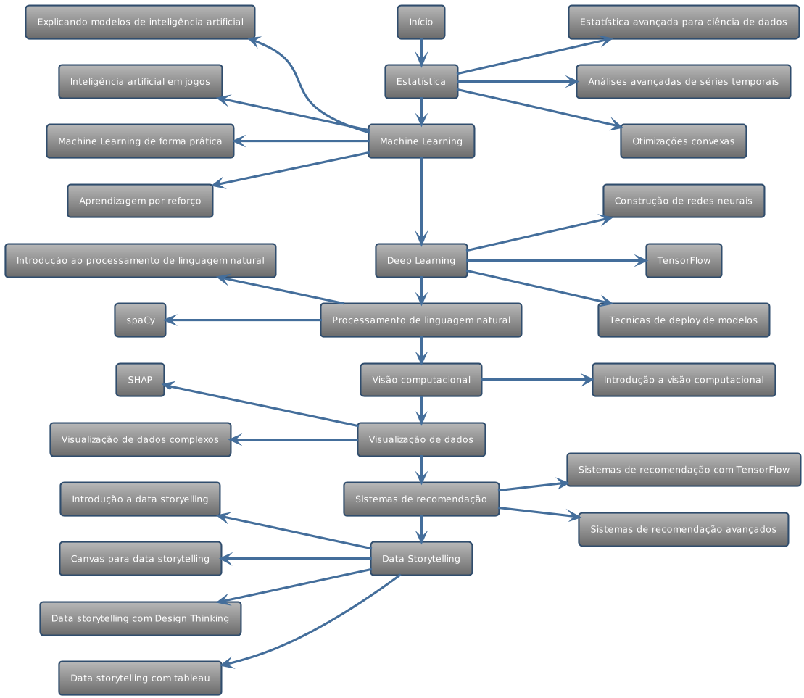

# Cientista de Dados

Para visualizar uma versão textual da trilha que também contem sugestões de conteúdos para cada item existente no diagrama, clique [aqui.](trilha-texto.md) 

Sugerimos que você analise as duas em conjunto.

> Os diagramas foram feitos utilizando a linguagem plantuml.

## Junior

Para tornar-se um cientista de dados esta é a trilha de conhecimento técnico que precisa ser percorrida, acreditamos que a partir deste conhecimento é possível atuar como cientista de dados júnior com eficiência.

Neste período de sua carreira sugerimos que você seja curioso e experimente ferramentas, tecnologias, linguagens, ambientes e demais fatores que lhe ajudam a ter uma visibilidade maior do mundo de desenvolvimento, esta fase é focada em aprendizado pois existe muito conteúdo para ser absorvido, então absorva, teste, treine, erre e continue. 

<b>Comportamentos esperados</b>

- Tentar sempre se ater ao método científico
- Ser curioso, extrair tudo que o dado pode falar para você
- Prezar pela qualidade dos modelos desenvolvidos
- Errar rápido
- Se desafiar em tarefas complexas
- Solicitar apoio quando necessário
- Estudar tecnologias

<b>Trilha</b>

## Pleno

Agora que você já é um cientista de dados e ainda entende que existe muito conhecimento pela frente chegou a hora de se preparar para o próximo passo, esta trilha para pleno nos faz ter segurança que você está tecnicamente pronto para assumir as responsabilidades futuras.

Neste período de sua carreira esperamos que você esteja pronto e resolvendo a maior parte das tarefas complexas que seu time assume sem grandes dificuldades, para este desenvolvimento de carreira as entregas e conclusão de atividades é fundamental, pois acreditamos que neste ponto aqui a experiencia começa a se equilibrar com o conhecimento, com este equilíbrio você deve ser capaz de resolver problemas complexos do negocio de maneira simples e eficiente além de manter a boa qualidade do ecossistema.

<b>Comportamentos</b>

- Seguir sempre o método científico
- Ser curioso, extrair tudo que o dado pode falar para você
- Prezar pela qualidade dos modelos desenvolvidos
- Resolver problemas complexos de forma rápida e eficiente
- Compreender regras de negocio e criar soluções aderentes
- Ter autonomia na resolução de tarefas
- Fomentar que todas as decisões da empresas sejam bem embasadas por dados.

<b>Trilha</b>

## Sênior

Agora que você já é um cientista de dados capaz de desenvolver modelos de inteligência artificial complexos de maneira eficiente, aqui estão algumas skills técnicas que esperamos ver para seu próximo passo, é importante ressaltar que neste próximo passo a postura comportamental é muito mais importante do que para os passos anteriores. 

Neste período de sua carreira esperamos que você esteja pronto para questionar quaisquer demandas que não façam sentido, ou mesmo os caminhos escolhidos para a solução, mas não é só questionar, também é apresentar alternativas coerentes, sugestões de melhorias e fazer parte da decisão de maneira assertiva. Nesta etapa esperamos que você seja visto como referencial técnico aos demais desenvolvedores, e que você esteja sempre se portando como protagonista, tanto no seu time, quanto no chapter. Esperamos de fato que você seja um verdadeiro resolvedor de problemas.

<b>Comportamentos</b>

- Seguir sempre o método científico
- Ser curioso, extrair tudo que o dado pode falar para você
- Prezar pela qualidade dos modelos desenvolvidos
- Criar soluções de longo prazo
- Visão holística da solução
- Questionar soluções e solicitações 
- Ser protagonista no squad e chapter
- Propor novas soluções que ainda não foram mapeadas
- Ter autonomia, capacidade de auto gestão e organização de trabalho
- Ter boa capacidade de auxiliar os colegas de trabalho

<b>Trilha</b>

