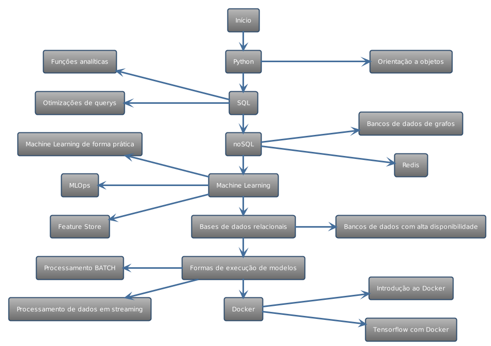

# Engenharia de Machine Learning

Para visualizar uma versão textual da trilha que também contem sugestões de conteúdos para cada item existente no diagrama, clique [aqui.](trilha-texto.md) 

Sugerimos que você analise as duas em conjunto.

> Os diagramas foram feitos utilizando a linguagem plantuml.

A posição de engenharia de machine learning tem como objetivo trabalhar na produtificação de modelos de inteligência artificial, garantindo que os modelos desenvolvidos pela ciência possam utilizar dos pipelines de dados desenvolvidos pela engenharia de dados para serem executados de acordo com a sua demanda, sendo que alguns necessitam estar disponíveis para consumo em tempo real, enquanto outros podem ser executados em lotes de processamento.

Para o profissional que seguir nessa trilha, é bastante importante que tenha a capacidade de transitar entre o que é desenvolvido pela ciência de dados, tão bem como pelo que é desenvolvido na engenharia de dados, tendo a capacidade de entender como um modelo é treinado, e como os pipelines são construídos. Isso se torna importante pois cada modelo tem sua especificidade, e suas necessidades únicas para ser disponibilizado como produto. Por esse motivo é bastante indicado que quem pretende seguir a trilha de engenharia de machine learning também veja com carinho toda a trilha de [Engenharia de Dados](../data-engineering/README.md) e a trilha de [Ciência de Dados](../data-science/README.md), visto que são conteúdos que podem agregar muito e facilitar na hora de publicar um modelo como produto.

Neste período de sua carreira esperamos que você esteja pronto para questionar quaisquer demandas que não façam sentido, ou mesmo os caminhos escolhidos para a solução, mas não é só questionar, também é apresentar alternativas coerentes, sugestões de melhorias e fazer parte da decisão de maneira assertiva. Nesta etapa esperamos que você seja visto como referencial técnico aos demais desenvolvedores, e que você esteja sempre se portando como protagonista, tanto no seu time, quanto no chapter. Esperamos de fato que você seja um verdadeiro resolvedor de problemas.

<b>Comportamentos esperados</b>
- Seguir sempre o método científico
- Ser curioso, extrair tudo que o dado pode falar para você
- Prezar pela qualidade dos modelos desenvolvidos
- Criar soluções de longo prazo
- Visão holística da solução
- Questionar soluções e solicitações 
- Ser protagonista no squad e chapter
- Propor novas soluções que ainda não foram mapeadas
- Ter autonomia, capacidade de auto gestão e organização de trabalho
- Ter boa capacidade de auxiliar os colegas de trabalho

<b>Trilha</b>

